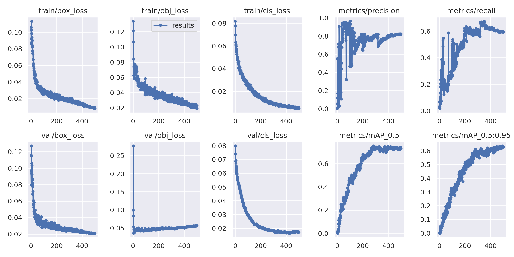

# Object detection of Floating Waste from Drone view

 \
↑ Object detection result from validation dataset

## Introduction
Plastic waste is among the most dangerous ocean pollutants and one of the main factors causing disruption of ocean ecosystems and marine organisms [1,2]. According to the recent studies, the global weight of floating plastic at about 5.25 trillion particles amounts to more than 268,000 tons [3,4], where these particles are produced from multiple sources related to wrong daily-life practices. The fishery activities, including waste fishing nets, are the major contributors to production of this huge amount of plastic waste and pollution of the oceans [5], where approx. 705,479 short tons of fishing gear are lost or discarded in the ocean every year and annually this gear captures and kills on average 136,000 seals, sea lions and whales [[6], [7], [8]]. (from [9]...) \
\
 \
↑ Picture of ocean waste and its detection.

## Data Overview
- images : 126 (.jpg files)
- label: 1334 instances
- external augmentation : none
- class : 23
- demension : 3024x3024px or 1200x800px
```
# Classes
nc: 23 # number of classes
names: [ 'Glass_bottle',
  'Glass_bulb',
  'Metal',
  'Mixed',
  'Net',
  'Net_rope',
  'PET_Bottle',
  'Plastic_Buoy',
  'Plastic_Buoy_Big',
  'Plastic_Buoy_round',
  'Plastic_ETC',
  'Rope',
  'Rope_clear',
  'Rope_decayed',
  'Rope_formed',
  'Rope_mix',
  'Rope_net',
  'Rope_shred',
  'Rope_thick',
  'Rope_thin',
  'Styrofoam_Box',
  'Styrofoam_Buoy',
  'Styrofoam_Piece'
]
```

- data example (cropped)

|label  |Net       |Plastic buoy      |Rope_clear     |
|----|--------------|--------------|--------------|
|image|![picture][pic1]|![picture][pic2]|![picture][pic3]|
|label  |Styrofoam_Buoy       |Rope_decayed      |Mixed        |
|image|![picture][pic4]|![picture][pic5]|![picture][pic6]|


[pic1]: results/Net.jpg
[pic2]: results/Plastic_Buoy.jpg
[pic3]: results/Rope_clear.jpg
[pic4]: results/Styrofoam_Buoy.jpg
[pic5]: results/Rope_decayed.jpg
[pic6]: results/Mixed.jpg

- label distribution


## data feature
- ambiguous boundary (overlapped and mixed)
- various size
- various shape (damaged) \
 \
↑ Even within same class, the shape,size and colour are heterogeneous due to its level of decay, existence of label, and manufacturer.


## System Used for training
- CPU : AMD EPYC Rome 7352 2P 24-Core CPU 2.3GHz 
- GPU : Tesla V100
- Ubuntu : 20.04.5 LTS (GNU/Linux 5.4.0-131-generic x86_64)
- CUDA : 11.7
- Conda : 4.8.3
- Python : 3.8.3
- YOLOv5 : https://github.com/ultralytics/yolov5 (version: f9ca365)

## packages in virtual environment
- numpy==1.23.5
- nvidia-cudnn-cu11==11.10.3.66
- opencv-python==4.6.0.66
- pandas==1.5.2
- Pillow==9.3.0
- torch==1.9.1+cu111
- torchvision==0.10.1+cu111


## Training Setting
- Base model : YOLOv5m6
(https://github.com/ultralytics/yolov5/releases/download/v6.2/yolov5m6.pt)
- Epoch : 500
- Batch size : 4

## Hyper parameter
- Input Image size : 1280
- Optimizer : SGD
- Learning rate : 0.01
- More detail : check [hyp.yaml](config/hyp.yaml)

# Result
## Evaluation of the best model on evaluation dataset
<!--  -->

## confusion matrix


## PRcurve


## Further things to do
- Organise annotation (e.g. put bottle types together, Styrofoam)
- Additional image preprocessing adjustment
- Still need more image samples for training... (e.g Net_Corn)
- The overall result is not that satisfying. Maybe we should start from labeling again.

## Data source
🌱 https://www.aihub.or.kr/ -> ㈜아이렘기술개발 \
🌱 Special thanks to the data provider!

# References
[1] M. Mofijur, S.F. Ahmed, S.M.A. Rahman, S.Y. Arafat Siddiki, A.B.M.S. Islam, M. Shahabuddin, P.L. Show, Source, distribution and emerging threat of micro- and nanoplastics to marine organism and human health: socio-economic impact and management strategies, Environ. Res. (2021), 10.1016/j.envres.2021.110857. \
[2] G. Chen, Y. Li, J. Wang, Occurrence and ecological impact of microplastics in aquaculture ecosystems, Chemosphere (2021), 10.1016/j.chemosphere.2021.129989. \
[3] F. Bandini, I. Hchaichi, N. Zitouni, O. Missawi, P.S. Cocconcelli, E. Puglisi, M. Banni, Bacterial community profiling of floating plastics from South Mediterranean sites: first evidence of effects on mussels as possible vehicles of transmission, J. Hazard Mater. (2021), 10.1016/j.jhazmat.2021.125079. \
[4] A. van Giezen, B. Wiegmans, Spoilt - Ocean Cleanup: Alternative Logistics Chains to Accommodate Plastic Waste Recycling: an Economic Evaluation,  Transportation Research Interdisciplinary Perspectives (2020), 10.1016/j.trip.2020.100115 \
[5] D.B. Daniel, S.N. Thomas, K.T. Thomson, Assessment of fishing-related plastic debris along the beaches in Kerala Coast, India, Mar. Pollut. Bull. (2020), 10.1016/j.marpolbul.2019.110696 \
[6] M.L.V. Barbosa-Filho, C.I. Seminara, D.C. Tavares, S. Siciliano, R.A. Hauser-Davis, J. da Silva Mourão, Artisanal Fisher perceptions on ghost nets in a tropical South Atlantic marine biodiversity hotspot: challenges to traditional fishing culture and implications for conservation strategies: ghost net impacts: artisanal Fisher perceptions and challenges to fishing culture, Ocean Coast Manag. (2020), 10.1016/j.ocecoaman.2020.105189 \
[7] K. Richardson, C. Wilcox, J. Vince, B.D. Hardesty, Challenges and misperceptions around global fishing gear loss estimates, Mar. Pol. (2021), 10.1016/j.marpol.2021.104522 \
[8] https://chinadialogueocean.net/5085-ghost-gear-a-grave-threat-to-ocean-life/ \
[9] EIMONTAS, J. et al. Catalytic pyrolysis kinetic behaviour and TG-FTIR-GC–MS analysis of waste fishing nets over ZSM-5 zeolite catalyst for caprolactam recovery. Renewable Energy, [s. l.], v. 179, p. 1385–1403, 2021. DOI 10.1016/j.renene.2021.07.143. Acesso em: 19 dez. 2022. \
[10] YOLOv5 🚀 : https://github.com/ultralytics/yolov5 \
